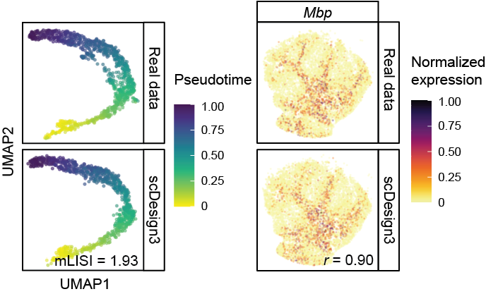
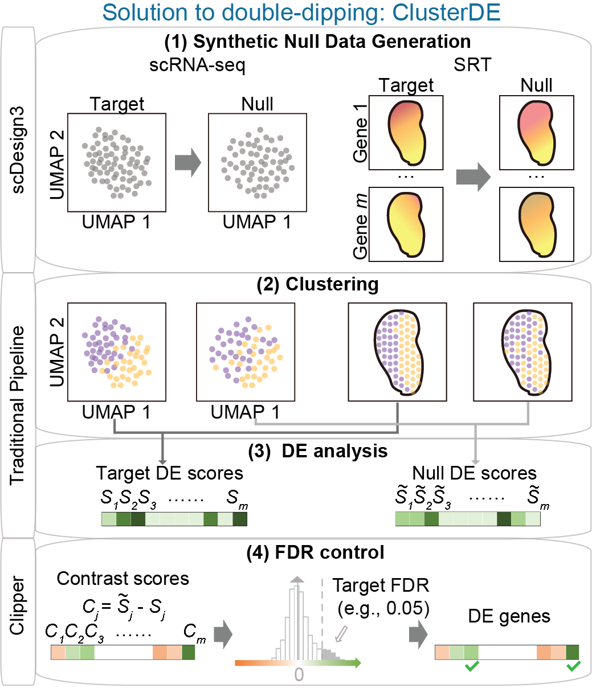
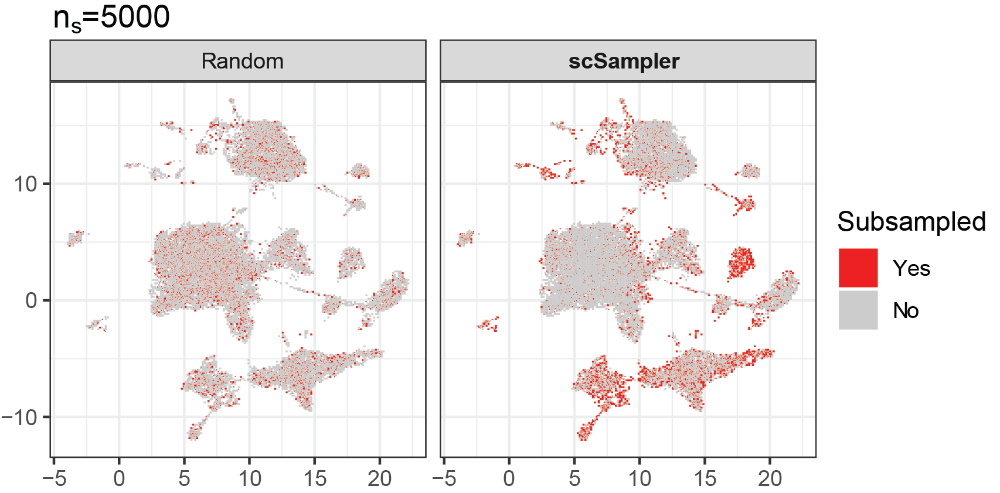

Our lab studies various problems of data science in genomics, combining *bioinformatics*, *statistics*, and *machine learning*. We develop computational tools for analyzing "omics" data. Currently, our lab focuses on single-cell transcriptomics (gene expression within individual cells) and spatial transcriptomics (gene expression across spatial locations). One central goal is to better understand the cellular heterogenuity and distinguish the biological signals from techinical variation. Several ongoing research directions include:

### Omics data simulation 

*How can we generate realistic omics data from computers?* The short answer is building a model that learns from the real data. The realistic simulation of single-cell and spatial multi-omics data plays a critical role in both evaluating **performance of computational tools** and facilitating the exploration of **experimental designs**.  We developed [scDesign3 (Nature Biotechnology, 2024)](https://doi.org/10.1038/s41587-023-01772-1), the first an "all-in-one" multimodal single-cell and spatial omics simulator which uses a parametric model. I also contributed to the development of [scReadSim (Nature Communications, 2023)](https://doi.org/10.1038/s41467-023-43162-w), a single-cell RNA-seq and ATAC-seq sequencing read read simulator, and [scDesign2 (Genome Biology, 2021)](https://doi.org/10.1186/s13059-021-02367-2), the predecessor of scDesign3.

  

### Statistical testing of gene expression and co-expression

*How can we accurately detect the changes in gene expression level and co-expression strengh?* We need to consider all types if variation and randomess for a solid conclusion. For example, in scRNA-seq, the cell types are usually annotated by clustering, then the differential expression (DE) test between clusters will find many fake DE genes (**double dipping**). We developed [ClusterDE (Accepted by RECOMB2025)](https://www.biorxiv.org/content/10.1101/2023.07.21.550107v1), a post-clustering DE test method controlling false discovery rate (FDR) under double dipping. Another exmample is the trajectory (pseudotime) inference; people usually ignore the fact that pseudotime is **random**. I developed [PseudotimeDE (Genome Biology, 2021)](https://doi.org/10.1186/s13059-021-02341-y), a DE test method for checking gene changes along cell pseudotime accounting for the uncertainty of pseudotime. In addition, we developed [scGTM (Bioinformatics, 2022)](https://doi.org/10.1093/bioinformatics/btac423), an interpretable statistical model for capturing **a gene's expression trend**.
Recently, we are developing a novel co-expression modeling method, named [spCorr](https://github.com/chexjiang/spCorr), for detecting the **dynamic co-expression changes across different locations** in spatial transcriptomics. By using a novel regression model, spCorr is very flexible and can deal with various confounding effects.

  

### Reducing the complexity of large-scale omics data

*How can we reduce the complexity of current datasets with numerous genes and millions of cells?* In the era of big data, one simple solution is selecting the **most imformative (or representitive) genes and cells**. We developed [scPNMF (Bioinformatics; ISMB/ECCB, 2021)](https://doi.org/10.1093/bioinformatics/btab273), a gene selection method by using dimentionality reduction (Projective NMF) to get a sparse encoding of the expression matrix. In addition, we developed [scSampler (Bioinformatics, 2022)](https://doi.org/10.1093/bioinformatics/btac271), a diveristy-preserving cell subsampling method for large-scale datasets.

  

