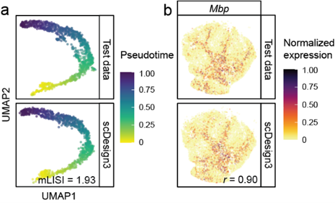

# Research

Our lab studies various problems of data science in genomics, combining *bioinformatics*, *statistics*, and *machine learning*. We develop computational tools for analyzing "omics" data. Currently, our lab focuses on single-cell transcriptomics (gene expression within individual cells) and spatial transcriptomics (gene expression across spatial locations). One central goal is to better understand the cellular heterogenuity and distinguish the biological signals from techinical variation. Several ongoing research directions include:

### Omics data simulation 
*How can we generate realistic omics data from computers?* We need to build a model that learns from the real data. The realistic simulation of single-cell and spatial multi-omics data plays a critical role in both evaluating **performance of computational tools** and facilitating the exploration of **experimental designs**.  We developed [scDesign3 (Nature Biotechnology, 2024)](https://doi.org/10.1038/s41587-023-01772-1), the first an "all-in-one" multimodal single-cell and spatial omics simulator which uses a parametric model. I also contributed to the development of [scReadSim (Nature Communications, 2023)](https://doi.org/10.1038/s41467-023-43162-w), a single-cell RNA-seq and ATAC-seq sequencing read read simulator, and [scDesign2 (Genome Biology, 2021)](https://doi.org/10.1186/s13059-021-02367-2), the predecessor of scDesign3. {: style="width: 300px; float: right; margin: 0px 10px"} 

### Statistical testing of gene expression and co-expression
*How can we detect the changes in gene expression level and co-expression strengh?* 
We developed [ClusterDE (Accepted by RECOMB2025)](https://www.biorxiv.org/content/10.1101/2023.07.21.550107v1), a post-clustering DE method controlling FDR under "double dipping (i.e., first clustering then DE between clusters)". Previously, I developed [PseudotimeDE (Genome Biology, 2021)](https://doi.org/10.1186/s13059-021-02341-y), a DE method for testing gene changes along cell pseudotime accounting for the uncertainty of pseudotime.

### Reducing the complexity of large-scale omics data
*How can we reduce the complexity of current datasets with numerous genes and millions of cells?* We need to select the most imformative (or representitive) genes and cells. We developed [scPNMF (Bioinformatics, 2021)](https://doi.org/10.1093/bioinformatics/btab273), a gene selection method by using dimentionality reduction (Projective NMF). We also developed [scSampler (Bioinformatics, 2022)](https://doi.org/10.1093/bioinformatics/btac271), a diveristy-preserving cell subsampling method for large-scale datasets.
